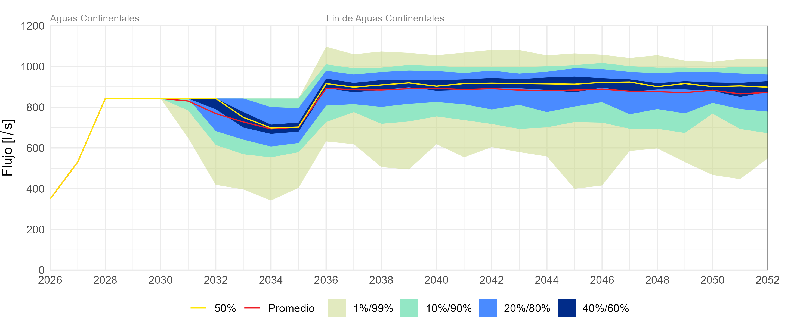

# Repositorio dedicado hidrologia-MBIO

El código se estructura de una manera “modular”, lo que en programación significa que cada módulo o script es independiente y se enfoca en una tarea especifica, esto tiene algunos beneficios cómo:
1.	Facilidad de uso: En vez de tener un solo código de 1000 líneas, se divide el código en pequeños módulos, lo que facilita la depuración del código.
2.	Reutilizable: Si se desea crear un nuevo código que ocupe los anteriores puede hacerse de manera natural.
3.	Fácil mantención en el tiempo: Permite a un equipo de trabajar en distintos módulos mejorando la capacidad del programa. 

## Modulos "Procesar"

Los módulos "Procesar" (ej: procesar01_est_daily.R) son los puntos de acceso a las distintas rutinas, cada archivo "procesarXX" se encarga de una tarea especifica, a continuación se detalla que hace cada archivo de forma individual.

1. **procesar01_est_daily.R**

El script lee datos diarios desde un archivo Excel con los percentiles (generados con GoldSim) y generar un gráfico de series de tiempo diarios hasta el 31 de diciembre de 2052. Luego guarda la figura como imagen .png en una carpeta de salida.

2. **procesar02_det_daily.R**

3. **procesar03_est_yearly.R**

4. **procesar04_directriz_AMSA.R**

5. **procesar05_archivos_txtGoldsim.R**

6. **procesar06_desalacionMax.R**

